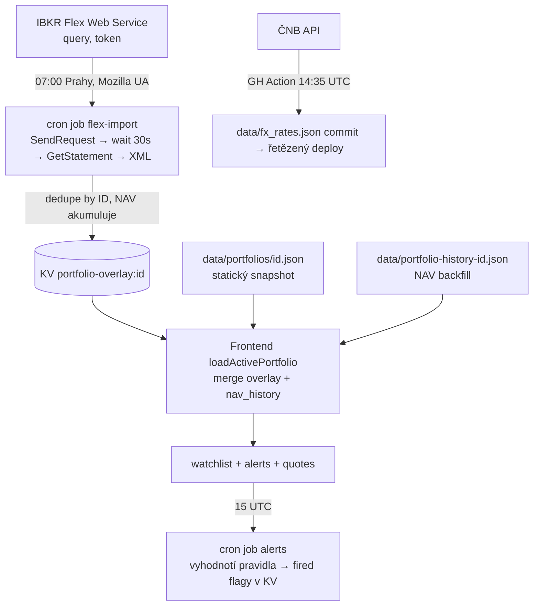

# CLAUDE.md — akcie-tracker

> Aktualizováno 2026-07-23 (migrace Pages → jeden Worker; revize kódu 2026-07-22 viz
> `REVIZE_REPORT.md`). Jediný projektový brief pro Claude (Cowork i Claude Code ho čtou
> automaticky). Obecná workflow pravidla viz `PROJECT_PLAYBOOK.md` (root projektu, mimo repo).

---

## Stav projektu

**Účel:** Privátní portfolio tracker pro PLEGI invest — dva brokery (Interactive
Brokers + Komerční banka), do budoucna další. Slouží zároveň jako evidenční podklad
pro účetnictví — transakční log + report v CZK + XLSX exporty.

**Stack:** Statické HTML + vanilla JS ES modules, žádný framework, žádný build krok,
žádný TypeScript. Backend = **jeden CF Worker `akcie-tracker`** (statické assety + `/api/*`
+ oba denní crony v jednom, entry `worker/index.js`) + **2 GitHub Actions workflows**
(deploy, FX update). Cloudflare KV namespace `AKCIE_TRACKER_KV`
(ID `6d78ccbecdc64d7e9798f1ed39fca35d`) s bindingem ve Workeru.

**Hosting:**
- **Worker `akcie-tracker`** — `https://akcie-tracker.lukas-pleskot.workers.dev/`
  (push do `main` → **Workers Builds**, CF git integrace → `npx wrangler deploy`;
  web, API i crony v jednom)
- **Cron joby uvnitř téhož Workeru** (dispatch podle `event.cron` ve `worker/index.js`):
  - flex-import v **07:00 Prahy celoročně** — crony jedou jen v UTC → dvojice triggerů
    `0 5 * * *` + `0 6 * * *`, handler pustí jen ten, kterému je v Praze právě 7:00
    (DST dvojče se skipne)
  - alerts `0 15 * * *` UTC (cca 1 h po otevření US burz)
- Bývalý Pages projekt a samostatné Workery `akcie-tracker-cron` +
  `akcie-tracker-flex-import` jsou zrušené (migrace 2026-07-23).

**Přístup:** ⚠️ **Cloudflare Access zatím NENÍ aktivní** (R1 z revize 2026-07-22).
Zmírnění: `noindex` + `robots.txt`. Po migraci na jeden Worker je zapnutí o dost
jednodušší — **service token už není potřeba** (crony čtou portfolio JSON přes ASSETS
binding a ceny přímo, žádné HTTP přes vlastní doménu). **TODO (Lukáš, CF Dashboard):**
1. Workers & Pages → `akcie-tracker` → Settings → **Domains & Routes** → u workers.dev
   **Enable Cloudflare Access** → politika Allow e-mail `lukas.pleskot@chrudim.cz`.
2. Ověřit: anonymní curl na `/` i `/data/...` → 302/403; přihlášení e-mail kódem projde.
3. Pozn.: manuální `/run/*` endpointy jsou pak také za Accessem — pro curl je potřeba
   Access service token, nebo prostě počkat na cron.

**Repo:** `lpleskot/akcie-tracker` (private, GitHub). **Git root je subfolder `web/`**,
ne kořen projektu — `workers/`, `.github/`, `scripts/` musí být **uvnitř** `web/`,
jinak se nedostanou do repa.

---

## Klíčová architektonická rozhodnutí

- **Source of truth = pole transakcí + cash_flows**, ne uložené pozice. FIFO se počítá v runtimu.
- **FIFO** s prorataovanou komisí do cost basis (BUY) i do net výnosu (SELL) per kus.
- **Jedno portfolio = jeden JSON soubor** v `data/portfolios/`. `manifest.json` listuje
  dostupná portfolia (`plegi-invest-ibkr` primary, `plegi-invest-kb`).
- **Multi-portfolio:** `state.portfolioId`, selector v hlavičce, localStorage memory.
  Při přepnutí: reload portfolio JSON + recompute FIFO + refresh Yahoo ceny.
  **Watchlist + Alerty + Notes + Deník = globální** (cross-portfolio).
- **Hybridní data model:**
  - **Statický JSON** v gitu = historický snapshot, manuálně commitnutý
  - **KV overlay** = denní auto-import přes IBKR Flex (Worker `flex-import` → KV `portfolio-overlay:{id}`)
  - Frontend `mergeOverlayIntoPortfolio()` přidává overlay eventy ke statickému JSON,
    dedupe podle `flex_id` (= IBKR `tradeID` / `transactionID` / `actionID`)
- **Účetně rozhoduje datum VYPOŘÁDÁNÍ (settle_date)**, ne datum obchodu — určuje rok
  i kurz ČNB. Prodej s obchodem 30.12. a vypořádáním 2.1. patří do nového roku.
  Platí pro: Report pro účetní (rok chips, FIFO párování, kurzy), export Reportu,
  export Transakcí pro účetní. FIFO closed lots nesou `buy_settle_date` + `sell_settle_date`.
  Tab Transakce (obrazovka) zůstává na datu obchodu. `fx_rates.json` proto pokrývá
  settle data všech transakcí (**346 dnů**).
- **Yahoo Finance** přes neoficiální `query1.finance.yahoo.com`, voláno ze serveru
  (CF Function `/api/quote`), cache 60 s, MINOR_UNITS scale (GBp/100, ZAc/100 atd.).
- **ČNB kurzy** v `data/fx_rates.json` — denní fetch přes GH Action `fx-update-cron.yml`
  (14:35 UTC). `getFxToCzk(date, ccy)` je strict by default (vrátí null pokud chybí),
  opt-in `{ allowFallback: true }` použije nejbližší předchozí. Důležité pro daňový
  report — žádné vymýšlení kurzů. Skript je **fail-fast**: při chybě fetche nejde dál
  (exit 1 → červený workflow), aby za dírou nevznikl trvale přeskočený den.
- **Sdílené moduly místo kopií** (R5/R6): FIFO engine `assets/js/fifo.js` a Flex
  transformace `assets/js/flex-shared.js` importuje frontend i cron job alerts
  (wrangler/esbuild je při deployi zabalí); `worker/api/lib.js` = Yahoo fetch
  (minor units!) + JSON helper — používá ho API vrstva i job alerts. Jeden Worker
  = vše se deployuje najednou, žádné path-based redeploye.
- **Vendorovaný SheetJS** `assets/js/vendor/xlsx.mini.min.js` — verze **0.20.3**
  (zjištěno z bundle při revizi 2026-07-22). Je mimo npm audit — verzi a CVE kontrolovat
  ručně při revizi (zdroj: cdn.sheetjs.com).

### Yahoo ticker mapování
- Manuální mapa v `instruments[<sym>].yahoo_symbol`. US tituly bez přípony, ostatní
  s burzovní příponou (`.TO`, `.ST`, `.PA`, `.DE`, `.AS`, `.AX`, `.WA`, `.MI`, `.L` …).
- **Auto-přidané instrumenty z Flex overlay** (funkce `ensureInstrument` v `app.js`)
  odvozují příponu z IBKR `listingExchange` přes mapu `IBKR_EXCHANGE_SUFFIX`
  (`deriveYahooSymbol`): `AEB→.AS`, `SBF→.PA`, `IBIS→.DE`, `SFB→.ST`, `TSE→.TO`, …
  Bez toho Yahoo napáruje holý symbol (např. „CSG") na cizí US titul a vrátí null cenu.
  Neznámá burza → symbol beze změny (fallback); doplnit do mapy podle potřeby.
- **Forex konverze NEJSOU pozice.** IBKR při nákupu titulu v cizí měně automaticky
  převádí měnu a účtuje forex trade (`assetCategory="CASH"`, symbol `BASE.QUOTE`
  jako `EUR.USD`, `USD.DKK`). `mergeOverlayIntoPortfolio` je přes `isForexConversion()`
  vyřazuje z transakcí/pozic a účtuje je jako **oboustrannou konverzi cashe**
  (base měna ← `quantity`, quote měna ← `netCash`).

---

## Daily data flow


```mermaid
flowchart TD
  IBKR[IBKR Flex Web Service<br/>query, token] -->|07:00 Prahy, Mozilla UA| FI[cron job flex-import<br/>SendRequest → wait 30s → GetStatement → XML]
  FI -->|dedupe by ID, NAV akumuluje| KV[(KV portfolio-overlay:id)]
  KV --> FE[Frontend loadActivePortfolio<br/>merge overlay + nav_history]
  STATIC[data/portfolios/id.json<br/>statický snapshot] --> FE
  HIST[data/portfolio-history-id.json<br/>NAV backfill] --> FE
  CNB[ČNB API] -->|GH Action 14:35 UTC| FX[data/fx_rates.json commit → řetězený deploy]
  FE --> WL[watchlist + alerts + quotes]
  WL -->|15 UTC| CRON[cron job alerts<br/>vyhodnotí pravidla → fired flagy v KV]
```

- **flex-import**: 2-call flow (SendRequest → wait 30s + retry → GetStatement → XML).
  **Používá Mozilla UA** — IBKR WAF blokuje bot-like UA na CF edge IP (403).
  Parsuje: Trade, CashTransaction, CorporateAction, Transfer, OpenPosition,
  EquitySummaryByReportDateInBase (NAV), MTMPerformanceSummaryUnderlying (YTD M2M);
  XML entity v atributech se dekódují. Merge dedupe by ID; **NAV snapshot AKUMULUJE
  by reportDate — nepřepisovat!** KV se ukládá i když přibyly JEN nové NAV dny (R3 —
  jinak by klidné dny mizely z grafu; Flex okno je ~7 dní). Manuální `/run/flex-import`
  vyžaduje header `x-admin-key` = secret `ADMIN_KEY`. Při selhání loguje (bez e-mailu);
  nepřímý signál = žlutý banner v UI, když overlay zestárne >4 dny (R7). Secrets:
  `FLEX_TOKEN`, `ADMIN_KEY`; var `FLEX_QUERY_ID` (1514926), `DRY_RUN` pro test bez zápisu.
  **Údržba overlay (~1× ročně):** overlay v KV roste donekonečna — promítnout obsah do
  statického portfolio JSON (commit) a overlay klíč smazat; další import začne načisto.
- **alerts**: čte watchlist + alerts + **portfolio-overlay přímo z KV**, statický
  portfolio JSON přes **ASSETS binding** a ceny přímo sdílenou `fetchYahooQuote` —
  žádné HTTP přes vlastní doménu, Cloudflare Access se jobu netýká. Overlay merguje
  sdílenými transformacemi a FIFO počítá sdíleným enginem (`fifo.js`) — vidí tedy
  i pozice z auto-importu (R6). **Bez notifikací** — e-maily (Resend) odstraněny
  2026-07-23; splněná pravidla zapíše jako `fired:*` flagy a UI je zobrazí v tabu
  Alerty (deduplikace: fired pravidlo se znovu nevyhodnotí do manuálního Re-arm).
  Selhání jobu je vidět jen v CF lozích. Manuální `/run/alerts` s `x-admin-key`;
  `/run/alerts?dry=1` = vyhodnotí bez zápisu fired. Hlídá jen IBKR portfolio
  (`PORTFOLIO_ID`), KB pozice ne.
- **fx-update-cron**: `scripts/fx-update.mjs` fetchne ČNB pro chybějící dny,
  commit + push `data/fx_rates.json` (potřebuje `contents: write`). Push spustí
  deploy přes Workers Builds webhook — ten funguje i pro commity z `GITHUB_TOKEN`
  (na rozdíl od `on: push` GitHub workflows), takže se kurzy dostanou na web.

---

## Portfolia

### `plegi-invest-ibkr.json` (Interactive Brokers, account U23077136)
- **Zdroj:** IBKR Trade Confirmation (HTML, prvotní) + IBKR Activity Statement (CSV, backfill)
  + IBKR Flex Web Service (denní auto → KV overlay).
- Inception 2025-11-24. **48 statických transakcí** + průběžně přibývá Flex auto-import.
- Instrumenty na NASDAQ, NYSE, Stockholm, Toronto, Paris, Xetra, Amsterdam (nové přes Flex).
- 1 corporate action (BKNG 25:1 split 2026-04-06). FIFO shodné s IBKR na cent.
- `data/portfolio-history-plegi-invest-ibkr.json` — NAV backfill od inception
  (jednorázově `outputs/backfill_nav.py`: Activity Statement CSV + Yahoo historical close),
  obsahuje i `deposits[]`. Tolerance vs IBKR snapshot ~1,5 % (dividend accruals + FX rounding).

### `plegi-invest-kb.json` (Komerční banka, account 1609386)
- **Zdroj:** KB TRN CP (PDF) + KB TRN CASH (PDF) + KB STAV PTF (snapshoty).
- Období 2022-12-30 → 2026-06-30 (inception = synthetic).
- **47 instrumentů** v 9 měnách (USD, EUR, CAD, SEK, PLN, GBP, AUD, DKK, CZK).
- **140 transakcí:**
  - 17 synthetic pre-2023 openings ze STAV PTF 31.3.2023 (cost basis = tržní cena k datu,
    skutečná pre-2023 nákupní cena neznámá — starší KB výpisy v MiFID formátu bez transakčních dat).
  - 123 reálných BUY/SELL z TRN CP 2023–2026-Q1. (Původních 7 synthetic Q2 2023 nahrazeno
    reálnými — Q2 2023 výpisy existují, jen jsou ve složce podkladů pod chybným názvem
    `Výpis 1.7.-30.9.2023-9.pdf` … `-12.pdf`.)
- **23 corporate actions** (Vklad/Výběr CP) — splity, rights issues, restructurings.
  Q1 2023 CAs filtrovány (`synthetic_cutoff_date = 2023-03-31`).
- **155 dividend** + 121 withholding tax, **118 cash flows**.
- **Q2 2026 import** (dividendy/daně/externí CA poplatky z TRN CASH; žádné obchody — TRN CP Q2
  neexistuje): datum = **vypořádání (= připsání na účet)**, ne splatnost. Důkaz: HUYA dividenda
  (splatnost 01.07, vypořádání 30.06) je v Q2 výpisu a v zůstatku k 30.06. Poplatky za vedení
  účtu ("Poplatek za správu" + DPH) se **neimportují** (řeší účetní, nepromítají se do ceny akcií).
  **Celá historie přerovnána na vypořádání** (audit 2026-07 přes reparsing všech TRN CASH + 2023
  Výpisů): 74 záznamů (2023–2026-Q1) posunuto o 1–5 dní, **žádná změna daňového roku**, celkový
  FX dopad +534 CZK. Re-audit: 0 záznamů zbývá na datu splatnosti.
- **18/18 otevřených pozic** match KB statementu (30.6.2026). Validace vs Sharesight
  Sold Securities: 32/34 prodejů match (2 nesoulady = CNE 1890 ks Sharesight chyba, IPO 1 ks zaokrouhlení).

### `data/fx_rates.json`
- ČNB rates pro 12 měn, **346 dnů** (pokrývá i settle data). Auto-update denně 14:35 UTC
  (`fx-update.mjs` — ČNB API `lang=EN`, `validFor` per-rate; forward-only od max data).

---

## Frontend taby (v pořadí)

`overview` Přehled pozic · `transactions` Transakce · `dividends` Dividendy ·
`allocation` Alokace · `alerts` Alerty · `watchlist` Watchlist · `journal` Deník investora ·
`report` Report pro účetní · `portfolio-history` Hodnota portfolia

- **Přehled pozic:** expandable detail per pozice (nákupy/prodeje/FIFO matching/split/
  dividendy/Total Return + Poznámka), sloupce vč. **Nereal. Z/Z** (jen otevřené loty)
  a **Celkem Z/Z** (real + nereal + dividendy).
- **Transakce:** filter rok / custom date / search, **Export pro účetní** (CZK přepočet ČNB) jen tady.
- **Report pro účetní:** per-sell breakdown FIFO matched buys, CZK přepočet dle vypořádání, XLSX export.
- **Hodnota portfolia:** NAV time-series (SVG chart), deposit markery, 3 emphasized globální
  dlaždice (Celkem vloženo / Aktuální hodnota / Rozdíl) + period dlaždice + tabulka per day.
- **Deník investora:** KV-backed text deník, inline editace, search.
- **Společné:** Search s ×, sort klikem na th, XLSX export per tab (SheetJS self-hosted).
  Summary dlaždice: Hodnota portfolia CZK (klik → Hodnota portfolia tab), Cash (multi-currency),
  Celkový výnos %, P.a., YTD, Dividendy (po dani).

---

## API endpointy (`worker/api/*`, router ve `worker/index.js`)

| Endpoint | Co |
|---|---|
| `GET /api/quote?symbols=…` | Yahoo Finance proxy, 60s cache, minor units fix |
| `GET/POST /api/watchlist` | KV `watchlist` CRUD (validace proti Yahoo při add) |
| `GET/POST /api/alerts` | KV `alerts` CRUD (add/delete/update/rearm) |
| `GET/POST /api/notes` | KV `notes` — globální mapa symbol → text |
| `GET/POST /api/journal` | KV `journal` CRUD |
| `GET /api/portfolio-overlay/[id]` | KV `portfolio-overlay:{id}` read pro frontend merge |

**KV klíče (sdílené):** `watchlist`, `alerts`, `notes`, `journal`,
`portfolio-overlay:{id}`, `fired:alert:{ruleId}:{symbol}`, `fired:watch:{itemId}:{ruleId}`.

**Secrets:** Worker `akcie-tracker` (CF Dashboard → Settings → Variables and Secrets):
`FLEX_TOKEN`, `ADMIN_KEY`. Deploy běží přes Workers Builds pod CF účtem — GitHub
secrets `CLOUDFLARE_API_TOKEN` / `CLOUDFLARE_ACCOUNT_ID` už nejsou potřeba (možno
smazat). Access service token není potřeba; Resend odstraněn (žádné e-maily).
Bez `ADMIN_KEY` jsou `/run/*` endpointy zavřené (403); cron triggery běží vždy.

---

## FIFO engine (`assets/js/fifo.js`)

`computePositions(transactions, corporateActions, dividends, withholdingTax)` → mapa
`symbol → { net_qty, cost_basis, avg_open_price, realized_pnl, closed_cost_basis,
total_invested, open_lots, closed_lots (vč. buy/sell_settle_date), splits,
dividend_records, withholding_records, net_dividend_local, … }`.

**Corporate actions:** `type:"split"` (`ratio_from`/`ratio_to`), a KB formát
`received_share`/`removed_share` — `preprocessCorporateActions()` páruje v okně 30 dnů
na stejném ISIN → auto-detect split. Unpaired `received_share` = bonus shares (lot za
nulový cost), unpaired `removed_share` = cancellation (FIFO konzumace bez realized P/L).
Cost basis prorataována o proporcionální komisi.

---

## Klíčové soubory (cheatsheet)

```
web/                                    ← repo root = asset složka Workeru
├── index.html                          ← 9 tabů, modaly, #warnings banner
├── assets/js/{app.js, fifo.js, flex-shared.js, vendor/xlsx.mini.min.js}
│                                       ← fifo+flex-shared sdílené s cron jobem alerts
├── assets/css/styles.css
├── worker/index.js                     ← entry: /api/* router + scheduled dispatch
├── worker/api/{lib,quote,watchlist,alerts,notes,journal,portfolio-overlay}.js
├── worker/jobs/{alerts,flex-import}.js ← cron joby
├── wrangler.toml                       ← name, assets, crony, KV binding, vars
├── .assetsignore                       ← co se neservíruje (worker/, *.md, …)
├── data/portfolios/{manifest,plegi-invest-ibkr,plegi-invest-kb}.json
├── data/portfolio-history-plegi-invest-ibkr.json, data/fx_rates.json
├── .github/workflows/fx-update-cron.yml    ← jediný GH workflow (ČNB kurzy)
├── scripts/fx-update.mjs
├── _headers                            ← CSP, HSTS, cache
├── REVIZE_REPORT.md                    ← zjištění a stav revizí kódu
└── CLAUDE.md                           ← TENTO soubor

~/Projects/akcie-tracker/  (mimo git)   PROJECT_PLAYBOOK.md, podklady/, inspirace/
```

---

## Co ještě není (budoucí iterace)

- ⚠️ **Zapnout Cloudflare Access** na workers.dev (jedním klikem, bez service tokenu)
  — viz sekce Přístup a `REVIZE_REPORT.md` R1. Priorita č. 1.
- Unit testy FIFO enginu (`node --test`, fixtures z validovaných dat) — REVIZE R9.
- Upload form pro nové broker exporty (zatím import přes Cowork chat — Lukáš nahraje PDF/CSV, Claude parsuje).
- Q3 2026+ inkrementální import KB.
- PDF export reportu pro účetní (zatím jen XLSX).
- Notifikace alertů (e-mail/Telegram) — Resend odstraněn 2026-07-23 (nevyužíval se),
  alerty se zatím jen zapisují jako fired a zobrazují v UI.
- Custom doména `akcie.plegiholding.cz` (zatím `*.workers.dev`).
- Delisted pozice (IPO.TO, SMSI, SPCE) — KB odepsala mimo formální TRN CP, ukazují non-zero qty.
- Doplňovat `IBKR_EXCHANGE_SUFFIX` o burzy, které se objeví u nových Flex titulů.

---

## Pravidla pro Claude

**Stack:**
- Vanilla JS, žádný framework, žádný build, žádný TypeScript.
- ES modules (`<script type="module">`, `import`/`export`).
- Žádný Tailwind ani utility CSS — vlastní `styles.css` s CSS proměnnými.

**Kód:**
- Komentáře vysvětlují „proč", ne „co". Funkce krátké, jedna věc na funkci.
- Číselné formátování přes `fmtNum`, `fmtPct`, `fmtMoney` z `fifo.js`, ne ručně.
- Locale `cs-CZ` pro čísla (desetinná čárka). UI texty česky, JS identifikátory anglicky.

**Data:**
- **Nikdy nepřepisovat raw transakce** — jen přidávat. Sells se nemažou, ani omylem zadané.
- Při importu broker exportu **deduplikovat** podle (date, time, symbol, type, qty, price).
- Validace: každá transakce má date, symbol, type ∈ {BUY,SELL}, qty > 0, price > 0.
- KV reads přes `env.AKCIE_TRACKER_KV.get(key, "json")`, writes přes `put(key, JSON.stringify(...))`.

**Privacy:**
- Repo private (finanční data), CF Access chrání URL. Žádný telemetry/analytics/cookie banner.

**Workflow (per PROJECT_PLAYBOOK.md sekce 2 & 6):**
- **Claude píše, Lukáš commituje** přes GitHub Desktop. **ŽÁDNÉ `git` CLI od Claude.**
- Po úpravě dodat: (1) seznam změněných souborů, (2) Summary + Description ve **dvou
  samostatných code blocích**, (3) co testovat po deployi.
- Atomic commits — jeden logický celek = jeden commit.
- Před rizikovou/infra změnou (workery, KV, schéma) upozornit a počkat na schválení.
- Po dokončení bloku nabídnout patch „Stav projektu" do tohoto souboru (dokumentačně
  významné změny: nové business pravidlo/metrika, nový API kontrakt, nová konfigurace/worker).
